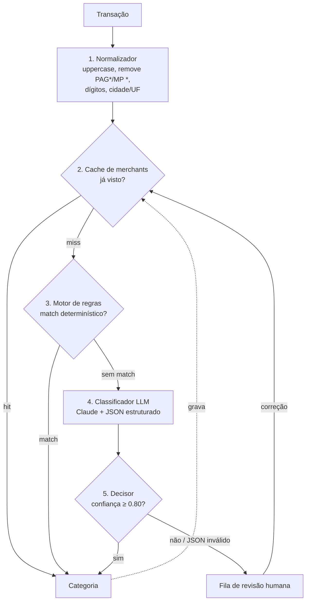

# Classificador Inteligente de Transações Financeiras

Pipeline híbrido de categorização automática de transações bancárias, combinando regras determinísticas e classificação por LLM.

## O problema

Extratos bancários chegam com descritores sujos e abreviados: `PAG*IFOOD SP`, `MP *UBER TRIP`, `PIX ENVIADO JOAO S`, `TARIFA PACOTE SERVICOS`. Categorizar isso manualmente não escala, e regex sozinho quebra a cada novo estabelecimento que aparece no mercado.

**Solução:** pipeline em camadas que combina regras determinísticas (baratas, previsíveis, auditáveis) com classificação por LLM (generaliza para descritores nunca vistos), com limiar de confiança e fila de revisão humana para os casos ambíguos.

**Por que esse desenho e não "só LLM":** custo, latência e determinismo. Se `PAG*IFOOD` já foi classificado como Alimentação uma vez, não há motivo para pagar uma chamada de API toda vez. E em domínio financeiro, um palpite errado com alta confiança é pior que um "não sei" — daí a fila de revisão.

## Arquitetura



Camadas 1–3 são gratuitas e instantâneas — só o que sobra vai para o LLM. Nos dados sintéticos do seed atual, cache + regras resolvem a maior parte das transações sem nenhuma chamada de API (ver [Resultados da avaliação](#resultados-da-avaliação)).

### Categorias

`Alimentação`, `Mercado`, `Transporte`, `Moradia`, `Saúde`, `Educação`, `Lazer`, `Vestuário`, `Serviços`, `Transferências`, `Renda`, `Taxas e Tarifas`, `Outros` — lista fechada, validada com `z.enum` na saída do LLM.

## Decisões de design

- **Regras antes do LLM, não no lugar dele.** O motor de regras (`backend/src/pipeline/rules.ts`) só resolve casos inequívocos (`PIX`, `TARIFA`, `SALARIO`, merchants conhecidos). Na dúvida, passa para o LLM em vez de arriscar um match errado.
- **Cache de merchants alimentado por regras, LLM aceito e correção humana.** Uma vez resolvido com confiança, o merchant normalizado nunca mais paga uma chamada de API.
- **Falha do LLM não derruba o pipeline.** JSON malformado, categoria fora do enum, timeout, rate limit (429 com backoff exponencial) ou qualquer erro inesperado da API viram `needs_review = true` em vez de propagar um erro — em domínio financeiro, "não sei" é melhor que um palpite errado.
- **`category`/`confidence` nulos em `classifications`** para o caso em que o LLM falha totalmente após os retries — ainda cai na fila de revisão, só que sem um palpite de categoria.
- **Concorrência limitada (5) no processamento em lote** para não estourar rate limit da API em cargas maiores.
- **Sem LangChain ou frameworks de agente.** Chamada HTTP direta ao `@anthropic-ai/sdk` é mais simples e mais fácil de explicar/defender.

## Stack

| Camada | Tecnologia |
|---|---|
| Linguagem | TypeScript (strict) |
| Backend | Node.js 20+, Fastify, Zod |
| Banco | PostgreSQL 16, Drizzle ORM |
| LLM | `@anthropic-ai/sdk` (Claude) |
| Testes | Vitest |
| Frontend | React + Vite + Tailwind |
| Infra | Docker Compose (Postgres local) |
| CI | GitHub Actions (lint + type-check + testes, separado por `backend/` e `frontend/`) |

## Como rodar

Backend e frontend estão em worktrees/branches separados enquanto em desenvolvimento: backend na branch `specs` (pasta `backend/`), frontend na branch `dev` (pasta `frontend/`). Ainda não há merge para `main`.

### Backend

```bash
cd backend
cp .env.example .env
docker compose up -d
npm install
npm run db:migrate
npm run seed          # popula 150 transações sintéticas
npm run dev            # API em http://localhost:3000
```

Para classificar com o LLM de verdade, defina `ANTHROPIC_API_KEY` no `.env` antes de rodar o pipeline:

```bash
npm run pipeline        # classifica as 150 transações e grava em classifications
npm run measure:rules   # % resolvido só por regras, sem tocar no LLM
```

Avaliação (rotulagem manual necessária, ver `backend/README.md`):

```bash
npm run eval:export
# preencha expected_category no CSV gerado
npm run eval:import -- eval_labels_para_rotular.csv
npm run eval
```

### Frontend

```bash
cd frontend
npm install
npm run dev   # dashboard em http://localhost:5173
```

Detalhes de cada endpoint da API em `backend/README.md`.

## Resultados da avaliação

O harness de avaliação (Fase 5) está pronto (`npm run eval`), mas a rotulagem manual das 100 transações em `eval_labels` ainda não foi feita — os números de acurácia dependem desse trabalho humano e serão preenchidos aqui assim que estiver pronto.

O que já dá pra medir sem rotulagem (execução determinística sobre o seed atual):
- **Regras resolvem ~90% das 150 transações sozinhas**, sem nenhuma chamada ao LLM (`npm run measure:rules`).
- Pipeline completo grava 150/150 classificações, com cache se auto-alimentando a partir de regras e classificações aceitas.

## Roadmap

| Fase | Status |
|---|---|
| 0 — Fundação | ✅ |
| 1 — Schema e dados | ✅ |
| 2 — Normalizador e motor de regras | ✅ |
| 3 — Classificador LLM | ✅ |
| 4 — Orquestrador | ✅ |
| 5 — Harness de avaliação | ✅ scripts prontos, rotulagem manual pendente |
| 6 — API REST | ✅ |
| 7 — Dashboard | 🔄 em andamento (branch `dev`) |
| 8 — Fechamento | 🔄 este README, CI e diagrama; falta screenshots e resultados reais de avaliação |
